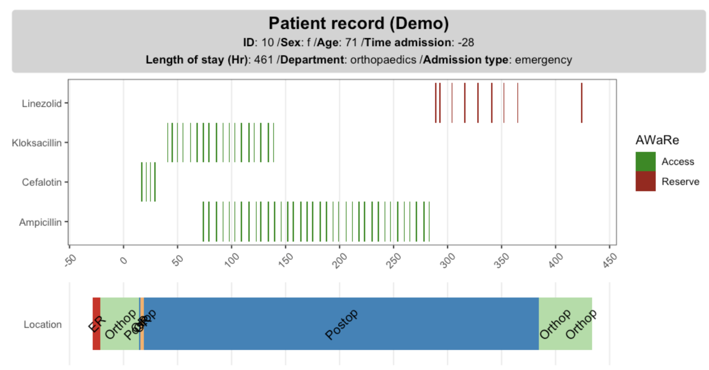

# ggehr <a href="https://andreaczhang.github.io/ggehr/"></a>


<!-- badges: start -->
[](https://lifecycle.r-lib.org/articles/stages.html#experimental)
[](https://github.com/andreaczhang/ggehr/actions/workflows/R-CMD-check.yaml)
<!-- badges: end -->

`ggehr` (read: gg E-H-R) stands for **ggplot2 extension for EHR data**, which provides a set of tools to facilitate EHR (Electronic Health Records) visualization.

`ggehr` package helps you make visualize EHR data, so that you can 

* have an overview of the **mixed type information** related to a patient;
* visually **identify the errors** in data recording.

## Why ggehr?

Electronic Health Records (EHR) data are patient records collected in healthcare facilities such as hospitals and clinics. Examples of hospital EHR data include demographics, admission information as well as treatments (drugs, procedures). This type of data is known to be messy and prone to error.

In principle all data generated in real-life contain time stamps; yet in practice we tend to omit the time information. When it comes EHR data it is essential that we keep the time stamps, as they provide valuable information on what treatments and procedures have the patients been going through. Broadly speaking, 

* temporal data: **treatments** (drug, procedures), **locations**
* static data: **demographics, admission information**

As EHR data are usually scattered across different tables, it is beneficial to collect them altogether and visualize in one or two graphs. 



More detailed example please see [Get Started](https://andreaczhang.github.io/ggehr/articles/ggehr.html).

## Installation 

The package is *not yet ready for release*. However if you wish, the development version an be installed from GitHub with 

```
# install.packages("devtools")
devtools::install_github("andreaczhang/ggehr")
```


